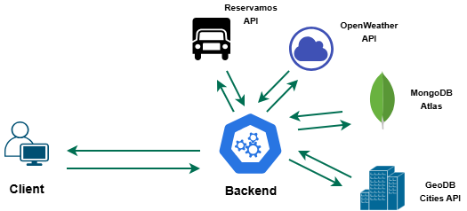

# 🌍 ReserHub - Weather Challenge

> This is a full-stack challenge for weather and city exploration. It consists of a modern **Reactapplication** for a rich user experience and a secure, powerful **Node.js + TypeScript + Express REST API** that serves as the central data engine.

## Architecture Overview

## 📦 Project Components

### 1. ⚡ Reserhub Challenge Backend

### Getting started

Please follow the instructions to running backend service [Go to README.md](backend/README.md)

### 2. 🚍☀️ ReserHub Challenge - Frontend

### Getting started

Please follow the instructions to running frontend [Go to README.md](frontend/reserhub-challenge-app/README.md)

---
